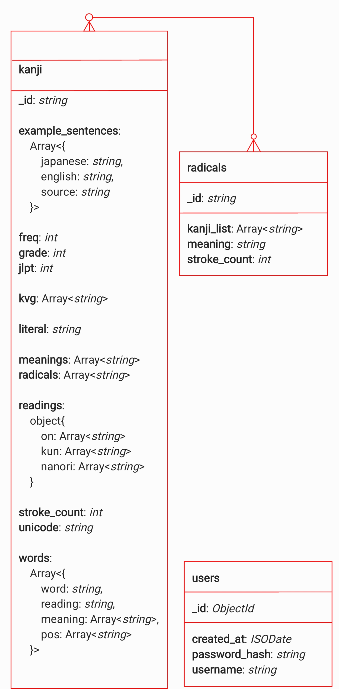

# МИНОБРНАУКИ РОССИИ

Санкт-Петербургский государственный электротехнический университет  
«ЛЭТИ» им. В.И. Ульянова (Ленина)  
Кафедра МОЕВМ

<br><br><br>

# Индивидуальное домашнее задание

по дисциплине «Введение в нереляционные базы данных»

**Тема:** информационная система поиска, просмотра и анализа кандзи

**Название проекта:** KanjiLookup

<br><br><br>

Студент гр. ________  
____________________

Студент гр. ________  
____________________

Студент гр. ________  
____________________

Преподаватель  
Заславский М.М.

<br><br><br>

Санкт-Петербург  
2026

---

# ЗАДАНИЕ

**Тема работы:** информационная система поиска, просмотра и анализа кандзи.

**Исходные данные:** наборы KANJIDIC2, JMdict, KanjiVG, RADKFILE и Tatoeba, объединённые в начальный JSON-seed приложения. В итоговой версии seed хранится в репозитории и загружается в MongoDB автоматически при первом запуске.

**Предлагаемая СУБД:** MongoDB.

**Содержание пояснительной записки:**

1. Введение.
2. Сценарии использования.
3. Модель данных.
4. Разработанное приложение.
5. Выводы.
6. Приложения.
7. Список использованных источников.

**Ссылка на репозиторий проекта:** <https://github.com/moevm/nsql1h26-kandz>

---

# Аннотация

В рамках индивидуального домашнего задания разработано веб-приложение KanjiLookup для поиска и разбора японских иероглифов кандзи. Приложение позволяет искать кандзи по рукописному вводу, радикалам, текстовым полям и подробным фильтрам, просматривать карточку иероглифа, порядок черт, чтения, значения, слова и примеры предложений. Для анализа данных реализована страница диаграмм, где пользователь выбирает оси X и Y, а графики пересчитываются по текущему подмножеству базы.

В качестве СУБД выбрана MongoDB. Основная коллекция `kanji` хранит иероглиф вместе с чтениями, значениями, радикалами, словами, примерами предложений и данными KanjiVG. Такая структура подходит для read-heavy приложения: полная карточка кандзи получается за один запрос, а сложные выборки, пагинация, группировки радикалов и диаграммы выполняются средствами aggregation pipeline MongoDB.

Backend реализован на FastAPI и PyMongo, frontend - на React, TypeScript, Vite и SCSS. Распознавание рукописного ввода выполняется на backend с помощью TFLite-модели DaKanji Single Kanji Recognition; frontend передаёт только список координат черт и не выполняет самостоятельную бизнес-логику. Проект разворачивается через Docker Compose и состоит из трёх сервисов: `db`, `backend`, `frontend`.

---

# Содержание

1. [Введение](#1-введение)
   - [1.1. Актуальность решаемой проблемы](#11-актуальность-решаемой-проблемы)
   - [1.2. Постановка задачи](#12-постановка-задачи)
   - [1.3. Предлагаемое решение](#13-предлагаемое-решение)
   - [1.4. Качественные требования к решению](#14-качественные-требования-к-решению)
2. [Сценарии использования](#2-сценарии-использования)
   - [2.1. Макет UI](#21-макет-ui)
   - [2.2. Импорт данных](#22-импорт-данных)
   - [2.3. Ручное добавление данных](#23-ручное-добавление-данных)
   - [2.4. Представление данных](#24-представление-данных)
   - [2.5. Анализ данных](#25-анализ-данных)
   - [2.6. Экспорт данных](#26-экспорт-данных)
   - [2.7. Вывод о преобладающих операциях](#27-вывод-о-преобладающих-операциях)
3. [Модель данных](#3-модель-данных)
   - [3.1. Нереляционная модель данных](#31-нереляционная-модель-данных)
   - [3.2. Реляционная модель данных](#32-реляционная-модель-данных)
   - [3.3. Сравнение моделей](#33-сравнение-моделей)
4. [Разработанное приложение](#4-разработанное-приложение)
   - [4.1. Краткое описание архитектуры](#41-краткое-описание-архитектуры)
   - [4.2. Использованные технологии](#42-использованные-технологии)
   - [4.3. Работа с MongoDB](#43-работа-с-mongodb)
   - [4.4. Распознавание рукописного ввода](#44-распознавание-рукописного-ввода)
   - [4.5. Импорт, экспорт и безопасность](#45-импорт-экспорт-и-безопасность)
   - [4.6. Тестирование](#46-тестирование)
   - [4.7. Снимки экрана приложения](#47-снимки-экрана-приложения)
5. [Выводы](#5-выводы)
   - [5.1. Достигнутые результаты](#51-достигнутые-результаты)
   - [5.2. Недостатки и пути улучшения](#52-недостатки-и-пути-улучшения)
   - [5.3. Будущее развитие решения](#53-будущее-развитие-решения)
6. [Приложения](#6-приложения)
   - [6.1. Документация по сборке и развёртыванию](#61-документация-по-сборке-и-развёртыванию)
   - [6.2. Инструкция пользователя](#62-инструкция-пользователя)
7. [Список использованных источников](#7-список-использованных-источников)

---

# 1. Введение

## 1.1. Актуальность решаемой проблемы

Изучение японского языка связано с постоянной работой с кандзи. Один и тот же иероглиф может иметь несколько чтений, несколько значений, входить в разные слова и использоваться в различных контекстах. При этом пользователь не всегда знает, как ввести нужный знак с клавиатуры: иногда у него есть только приблизительный рисунок, радикалы или представление о количестве черт.

Существующие словари часто разделяют эти сценарии: рукописный поиск, поиск по радикалам, просмотр слов и анализ частотности находятся в разных инструментах. Для пользователя удобнее иметь единую систему, где можно сузить базу фильтрами, нарисовать знак, посмотреть похожие кандзи, перейти в карточку и увидеть связанные слова, примеры предложений и порядок написания.

С точки зрения курса по нереляционным базам данных задача также показательна: данные о кандзи имеют естественно вложенную структуру. В одном объекте удобно хранить массивы чтений, значений, слов, предложений и радикалов. Поэтому MongoDB хорошо подходит для проекта: она позволяет хранить карточку иероглифа как документ и использовать aggregation pipeline для поиска, анализа и статистики.

## 1.2. Постановка задачи

Необходимо разработать веб-приложение KanjiLookup, которое должно выполнять следующие функции:

- запускаться из чистого клона репозитория через Docker Compose;
- автоматически заполнять MongoDB тестовыми данными при первом запуске;
- отображать каталог кандзи с server-side пагинацией;
- предоставлять подробную карточку отдельного кандзи;
- выполнять поиск по рукописному вводу;
- выполнять поиск по радикалам и текстовым полям;
- поддерживать глобальную многокритериальную фильтрацию;
- строить кастомизируемые диаграммы по выбранным осям X и Y;
- поддерживать импорт и экспорт всей базы данных в JSON;
- ограничивать операции изменения данных административной авторизацией.

## 1.3. Предлагаемое решение

Архитектура приложения разделена на три контейнера:

- `db` - MongoDB `7.0.16`, отдельный контейнер базы данных без публикации порта наружу;
- `backend` - FastAPI-приложение, реализующее API, работу с MongoDB, импорт/экспорт, авторизацию и распознавание рукописного ввода;
- `frontend` - React/Vite-приложение, собранное в статические файлы и раздаваемое через nginx.

Основная логика поиска и анализа выполняется на backend и в MongoDB. Frontend отвечает за отображение интерфейса, ввод пользователя и отправку запросов к API. Это соответствует цели проекта: использовать возможности СУБД для фильтрации, агрегаций, пагинации и анализа данных.

## 1.4. Качественные требования к решению

К приложению предъявляются следующие требования:

- единый пользовательский интерфейс без скрытых страниц, доступных только прямым вводом URL;
- устойчивый запуск через Docker Compose;
- читаемая архитектура backend и frontend;
- хранение данных внутри MongoDB-контейнера с использованием Docker volumes;
- отсутствие публикации порта базы данных наружу;
- server-side фильтрация и пагинация;
- защита административных действий токеном;
- достаточный seed для демонстрации сценариев без ручного наполнения базы;
- аккуратный, строгий и понятный интерфейс.

---

# 2. Сценарии использования

## 2.1. Макет UI

В ранней версии проекта был подготовлен схематичный макет интерфейса. В итоговой версии структура приложения изменилась: отдельные вкладки фильтрации по числу черт и уровням заменены общей боковой панелью фильтров, которая применяется к поиску, таблице данных и диаграммам. Поэтому в пояснительной записке в качестве актуального экранного макета используются снимки финального интерфейса, приведённые в описании сценариев ниже.

## 2.2. Импорт данных

**Действующие лица:** администратор, система.

**Цель:** заменить содержимое базы данных данными из JSON-файла.

**Основной сценарий:**

1. Администратор открывает раздел «Данные».
2. Система отображает форму входа администратора.
3. Администратор вводит логин и пароль.
4. После успешного входа администратор нажимает кнопку «Импорт».
5. Система открывает диалог выбора JSON-файла.
6. Администратор выбирает файл.
7. Backend валидирует структуру файла.
8. Система заменяет коллекции `kanji` и `radicals`.
9. Если в импортируемом файле нет коллекции `users`, текущие администраторы сохраняются, чтобы не потерять доступ к системе.
10. Система отображает сообщение об успешном завершении импорта.

**Альтернативный сценарий:** если пользователь не вошёл как администратор, backend отклоняет запрос, а frontend показывает сообщение о необходимости входа.

## 2.3. Ручное добавление данных

**Действующие лица:** администратор, система.

**Цель:** добавить новый кандзи в базу данных через интерфейс.

**Основной сценарий:**

1. Администратор открывает раздел «Данные».
2. Администратор входит в систему.
3. Система отображает форму «Новая запись».
4. Администратор вводит символ, значения, число черт, класс, JLPT, радикалы и чтения.
5. Backend валидирует запись.
6. MongoDB сохраняет документ в коллекции `kanji`.
7. Список записей обновляется.

Добавление новой записи без входа администратора невозможно. Это проверяется на backend, поэтому обход frontend-интерфейса не даёт доступа к защищённой операции.

## 2.4. Представление данных

### 2.4.1. Рукописный поиск

**Действующие лица:** пользователь, система.

**Цель:** найти кандзи по рисунку.

**Основной сценарий:**

1. Пользователь открывает вкладку «Рисунок».
2. Система отображает холст для рукописного ввода.
3. Пользователь рисует знак мышью или пальцем.
4. Frontend сохраняет координаты черт и отправляет их на backend.
5. Backend нормализует изображение, передаёт его TFLite-модели и получает список кандидатов.
6. MongoDB применяет текущие фильтры к кандидатам.
7. Система отображает похожие кандзи.

На рисунке 1 показана страница рукописного ввода.


### 2.4.2. Поиск по радикалам

**Действующие лица:** пользователь, система.

**Цель:** найти иероглифы, содержащие выбранные радикалы.

**Основной сценарий:**

1. Пользователь открывает вкладку «Радикалы».
2. Система загружает сгруппированный список радикалов.
3. Пользователь выбирает один или несколько радикалов.
4. После короткой задержки выбора frontend отправляет запрос на backend.
5. MongoDB выполняет фильтрацию по массиву `radicals` с использованием `$all`.
6. Система отображает каталог подходящих кандзи.

На рисунке 2 показана страница поиска по радикалам.


### 2.4.3. Карточка кандзи

**Действующие лица:** пользователь, система.

**Цель:** получить полную информацию об отдельном иероглифе.

**Основной сценарий:**

1. Пользователь выбирает кандзи из списка.
2. Система открывает страницу карточки.
3. Backend получает документ по `_id`.
4. На странице отображаются значения, чтения, радикалы, слова, примеры предложений и кнопка просмотра порядка черт.

На рисунке 3 показана карточка кандзи.


### 2.4.4. Таблица данных

В разделе «Данные» пользователь видит таблицу коллекции `kanji`. Таблица использует server-side пагинацию: frontend передаёт номер страницы и размер страницы, а backend возвращает только нужный фрагмент данных и общее количество записей.

На рисунке 4 показан раздел данных: открыта боковая панель с тремя активными фильтрами, таблица построена по текущей выборке, а интерфейс сообщает, что для импорта требуется вход администратора.


На рисунке 5 показан административный сценарий импорта: после входа пользователь нажимает кнопку импорта, система открывает модальное окно выбора JSON-файла, а боковая панель фильтров не мешает работе с диалогом.


## 2.5. Анализ данных

**Действующие лица:** пользователь, система.

**Цель:** построить диаграмму по выбранным атрибутам текущего подмножества базы.

**Основной сценарий:**

1. Пользователь задаёт ограничения в боковой панели фильтров.
2. Пользователь открывает вкладку «Диаграммы».
3. Пользователь выбирает, что отложить по оси X и по оси Y.
4. Frontend отправляет параметры фильтра и выбранные оси на backend.
5. MongoDB выполняет aggregation pipeline с `$match`, `$group`, `$avg`, `$sum`, `$size` или `$unwind`.
6. Frontend отображает диаграмму.
7. Пользователь может добавить несколько графиков и сравнивать разные срезы данных.

Поддерживаются следующие смысловые сценарии:

- ось X: JLPT, ось Y: средняя частотность;
- ось X: количество черт, ось Y: количество слов;
- ось X: школьный класс, ось Y: среднее количество черт;
- ось X: топ радикалов, ось Y: количество кандзи.

На рисунке 6 показана страница диаграмм: применены шесть фильтров и построены два графика для разных аналитических сценариев.


## 2.6. Экспорт данных

**Действующие лица:** администратор, система.

**Цель:** получить полную копию данных приложения в машиночитаемом формате.

**Основной сценарий:**

1. Администратор открывает раздел «Данные».
2. Администратор входит в систему.
3. Администратор нажимает кнопку «Экспорт».
4. Backend проверяет bearer-токен.
5. Backend выгружает коллекции `kanji`, `radicals` и `users`.
6. Система отдаёт JSON-файл браузеру.

Экспорт защищён тем же административным входом, что импорт и ручное добавление записи.

## 2.7. Вывод о преобладающих операциях

В приложении преобладают операции чтения: пользователь ищет кандзи, просматривает карточки, фильтрует каталог, строит диаграммы и работает с радикалами. Запись выполняется редко и относится к административным сценариям: импорт, ручное добавление и редактирование записей.

Следовательно, приложение является read-heavy. Это обосновывает выбор денормализованной MongoDB-модели: данные карточки кандзи хранятся в одном документе и читаются без JOIN-ов.

---

# 3. Модель данных

## 3.1. Нереляционная модель данных

В качестве нереляционной СУБД используется MongoDB.

Графическое представление модели показано на рисунке 7.



### 3.1.1. Коллекция `kanji`

Коллекция `kanji` является основной коллекцией системы. Каждый документ представляет один кандзи и содержит связанные данные:

- `_id` - символ кандзи;
- `literal` - символ для отображения;
- `unicode` - шестнадцатеричный код символа;
- `stroke_count` - количество черт;
- `grade` - школьный класс;
- `jlpt` - уровень JLPT;
- `freq` - частотность;
- `readings` - объект с массивами `on`, `kun`, `nanori`;
- `meanings` - массив значений;
- `radicals` - массив радикалов;
- `words` - массив слов из JMdict;
- `example_sentences` - массив предложений из Tatoeba;
- `kvg` - данные KanjiVG для порядка черт.

Поля документа можно разделить на несколько функциональных групп.

| Группа данных | Поля | Назначение |
|---|---|---|
| Идентификация | `_id`, `literal`, `unicode` | быстрый поиск и однозначная привязка документа к символу |
| Учебная классификация | `stroke_count`, `grade`, `jlpt`, `freq` | фильтры, сортировка и построение статистики |
| Лингвистическое описание | `readings`, `meanings` | отображение чтений и значений в карточке |
| Связанные элементы | `radicals`, `words`, `example_sentences` | поиск по радикалам, примеры слов и предложений |
| Графика написания | `kvg` | отображение порядка черт и SVG-анимации |

Пример документа:

```json
{
  "_id": "斑",
  "literal": "斑",
  "unicode": "6591",
  "stroke_count": 12,
  "grade": 8,
  "jlpt": null,
  "freq": 2165,
  "readings": {
    "on": ["ハン"],
    "kun": ["ふ", "まだら"],
    "nanori": ["い"]
  },
  "meanings": ["spot", "blemish", "speck", "patches"],
  "radicals": ["王", "文"],
  "words": [
    {
      "word": "斑点",
      "reading": "はんてん",
      "meanings": ["(scattered) spots", "specks", "speckles"],
      "pos": ["n"]
    }
  ],
  "example_sentences": [
    {
      "japanese": "豹はその斑点を変えることはできない。",
      "english": "A leopard cannot change his spots.",
      "source": "tatoeba"
    }
  ],
  "kvg": {
    "svg_path": "06591-Kaisho.svg"
  }
}
```

### 3.1.2. Коллекция `radicals`

Коллекция `radicals` хранит справочник радикалов:

- `_id` - символ радикала;
- `kanji_list` - список кандзи, содержащих радикал;
- `stroke_count` - число черт радикала;
- `meaning` - значение радикала.

Эта коллекция используется как справочник для страницы радикалов. Backend группирует радикалы средствами MongoDB и отдаёт уже подготовленные группы, поэтому frontend не рассчитывает категории самостоятельно.

Пример документа:

```json
{
  "_id": "口",
  "kanji_list": ["唇", "吃", "叫", "呼", "味"],
  "stroke_count": 3,
  "meaning": "mouth"
}
```

### 3.1.3. Коллекция `users`

Коллекция `users` хранит учётные записи администраторов:

- `_id` - идентификатор;
- `username` - логин;
- `password_hash` - хеш пароля;
- `created_at` - дата создания.

Обычные пользователи не регистрируются: просмотр и поиск доступны без входа. Авторизация нужна только для операций изменения данных.

### 3.1.4. Оценка объёма MongoDB-модели

В модели используются следующие параметры:

- `K = 10 383` - количество документов `kanji`;
- `R = 253` - количество радикалов;
- `A = 1` - количество начальных администраторов в seed;
- `K_words = 5` - среднее количество слов на кандзи;
- `K_sents = 0.84` - среднее количество предложений на кандзи;
- `K_rads = 4.47` - среднее количество радикалов на кандзи.

Оценка одного документа `kanji`:

```text
базовые поля:        154 байта
words:          5 * 93 = 465 байт
sentences:   0.84 * 138 = 116 байт
итого:                 735 байт
```

Размер коллекции `kanji`:

```text
10 383 * 735 = 7 631 505 байт
```

Размер одного документа `radicals` оценивается в 891 байт:

```text
253 * 891 = 225 423 байта
```

Размер одного документа `users` оценивается в 108 байт:

```text
1 * 108 = 108 байт
```

Итоговая оценка:

```text
modelSize(K, R, A) = 735*K + 891*R + 108*A
modelSize(K) = 735*K + 225 531
```

Для текущего seed:

```text
7 631 505 + 225 423 + 108 = 7 857 036 байт ≈ 7.49 МБ
```

Фактический JSON-seed в репозитории занимает около 14.3 МБ, так как JSON содержит текстовые имена полей, пробельные и структурные символы, а оценка выше относится к приближённому BSON-представлению данных.

### 3.1.5. Избыточность MongoDB-модели

Основная избыточность связана с денормализацией слов из JMdict. Одно слово может содержать несколько кандзи и поэтому встречается в нескольких документах. При средней длине слова около двух кандзи каждое слово дублируется примерно один раз.

Суммарная добавка за дублирование:

```text
65 000 слов * 1 дополнительная копия * 93 байта ≈ 6 045 000 байт
```

Объём без этой избыточности:

```text
7 857 036 - 6 045 000 ≈ 1 812 036 байт
```

Коэффициент избыточности:

```text
7 857 036 / 1 812 036 ≈ 4.34
```

Избыточность является осознанной: она уменьшает число запросов и позволяет получать полную карточку кандзи из одной коллекции.

### 3.1.6. Направление роста MongoDB-модели

Рост MongoDB-модели в первую очередь определяется количеством документов `kanji`. При добавлении нового кандзи увеличивается один основной документ, а также могут увеличиться массивы `kanji_list` в коллекции `radicals`. Поэтому общий рост можно считать линейным по числу кандзи:

```text
O(K + R + A)
```

где `K` - количество кандзи, `R` - количество радикалов, `A` - количество администраторов.

На практике сильнее всего на объём влияют вложенные массивы `words` и `example_sentences`. Если расширять словарь словами и предложениями, модель будет расти по формуле:

```text
O(K + W_embedded + S_embedded + R)
```

где `W_embedded` - число слов, сохранённых внутри документов кандзи, а `S_embedded` - число примеров предложений. Такой рост допустим для проекта, потому что приложение в основном читает данные. Пользователь часто открывает карточку и ожидает увидеть значения, чтения, слова и примеры сразу, без последовательности дополнительных запросов.

По времени выполнения основные сценарии имеют следующий характер:

- получение карточки по `_id` выполняется как точечный запрос по индексированному ключу;
- фильтрация по числу черт, JLPT, классу и частотности использует условия `$gte`, `$lte`, `$in` и сортировку;
- поиск по радикалам использует массив `radicals` и оператор `$all`;
- диаграммы выполняются через aggregation pipeline и зависят от размера отфильтрованной выборки;
- группировка радикалов использует коллекцию `radicals`, которая существенно меньше основной коллекции `kanji`.

Если база будет расти дальше, модель можно усилить дополнительными индексами и материализованными счётчиками: количеством слов, примеров, радикалов и чтений. В текущей реализации эти значения уже используются в фильтрах и диаграммах, а MongoDB выполняет вычисления на стороне backend-запросов.

### 3.1.7. Запросы к MongoDB-модели

Получение карточки кандзи:

```javascript
db.kanji.findOne({ _id: "斑" })
```

Поиск по радикалу:

```javascript
db.kanji.find({ radicals: "口" }).limit(50)
```

Поиск по нескольким радикалам:

```javascript
db.kanji.find({ radicals: { $all: ["口", "日"] } })
```

Поиск с фильтрами:

```javascript
db.kanji.find({
  stroke_count: { $gte: 5, $lte: 15 },
  jlpt: { $in: [3, 4] },
  meanings: { $regex: "road", $options: "i" }
})
```

Server-side пагинация:

```javascript
db.kanji.aggregate([
  { $match: query },
  { $sort: { freq: 1, stroke_count: 1, _id: 1 } },
  { $skip: (page - 1) * pageSize },
  { $limit: pageSize }
])
```

Диаграмма по JLPT и средней частотности:

```javascript
db.kanji.aggregate([
  { $match: query },
  { $group: { _id: "$jlpt", value: { $avg: "$freq" } } },
  { $sort: { _id: 1 } }
])
```

Группировка радикалов по использованию:

```javascript
db.radicals.aggregate([
  { $addFields: { usage: { $size: "$kanji_list" } } },
  { $bucketAuto: { groupBy: "$usage", buckets: 5 } }
])
```

## 3.2. Реляционная модель данных

Реляционный аналог может быть реализован в PostgreSQL. Графическое представление модели показано на рисунке 8.


Основные таблицы:

- `kanji` - базовые поля кандзи;
- `readings` - чтения;
- `meanings` - значения;
- `radicals` - справочник радикалов;
- `kanji_radicals` - связь многие-ко-многим;
- `words` - слова;
- `word_meanings` - значения и грамматические теги слов;
- `sentences` - примеры предложений;
- `users` - администраторы.

Оценка объёма SQL-модели:

```text
kanji:           695 661 байт
readings:      1 378 701 байт
meanings:        965 619 байт
radicals:          7 843 байта
kanji_radicals:  742 576 байт
words:         2 388 090 байт
word_meanings: 5 606 820 байт
sentences:     1 273 108 байт
users:                96 байт
итого:        13 058 514 байт ≈ 12.45 МБ
```

Формула:

```text
modelSize(K, R, A) ≈ 1257*K + 31*R + 96*A
```

### 3.2.1. Избыточность и направление роста SQL-модели

В реляционной модели избыточность ниже для слов и значений, потому что повторяющиеся сущности можно вынести в отдельные таблицы и связывать через внешние ключи. Однако это снижает удобство чтения полной карточки: данные одного кандзи оказываются распределены между несколькими таблицами.

Рост SQL-модели также линейный, но зависит не только от количества кандзи, а и от количества строк в дочерних таблицах:

```text
O(K + Readings + Meanings + KanjiRadicals + Words + WordMeanings + Sentences + A)
```

При увеличении числа слов и предложений быстрее всего растут таблицы `words`, `word_meanings` и `sentences`. При увеличении числа кандзи растёт не только таблица `kanji`, но и таблицы связей `readings`, `meanings` и `kanji_radicals`.

Для аналитических запросов SQL-модель остаётся применимой, но требует JOIN-ов и группировок по нескольким таблицам. Для карточки кандзи это особенно заметно: чтобы получить чтения, значения, радикалы, слова и примеры, необходимо объединять несколько таблиц или выполнять серию запросов. В MongoDB эти данные лежат рядом внутри документа.

Пример получения карточки кандзи:

```sql
SELECT k.*,
       array_agg(DISTINCT r.type || ':' || r.value) AS readings,
       array_agg(DISTINCT m.value) AS meanings
FROM kanji k
LEFT JOIN readings r ON r.kanji_id = k.id
LEFT JOIN meanings m ON m.kanji_id = k.id
WHERE k.literal = '斑'
GROUP BY k.id;
```

Для полной карточки также потребуются отдельные обращения или дополнительные JOIN-ы к словам, значениям слов, предложениям и радикалам.

## 3.3. Сравнение моделей

| Сценарий | MongoDB | SQL | Практический эффект |
|---|---:|---:|---|
| Полная карточка кандзи | 1 коллекция | 5 и более таблиц | MongoDB быстрее отдаёт экран карточки без сборки данных через JOIN |
| Поиск по радикалу | 1 коллекция | 3 таблицы | массив `radicals` позволяет использовать один запрос к основной коллекции |
| Поиск по нескольким радикалам | 1 коллекция и `$all` | 3 таблицы и `HAVING` | MongoDB проще выражает условие «содержит все выбранные радикалы» |
| Поиск по числу черт | 1 коллекция | 1 таблица | модели сопоставимы, если поле индексировано |
| Диаграммы по базовым полям | 1 коллекция и aggregation pipeline | 1-3 таблицы | MongoDB удобно строит срезы по вложенным и вычисляемым полям |
| Экспорт всех данных | 3 коллекции | 8-9 таблиц | документная модель проще выгружается целиком |
| Импорт всех данных | 3 коллекции | 8-9 таблиц | меньше зависимостей между таблицами и порядка вставки |

По объёму MongoDB-модель компактнее в приведённой оценке: около 7.49 МБ против 12.45 МБ у SQL-модели. При этом в MongoDB присутствует логическая избыточность из-за дублирования слов, но она оправдана профилем нагрузки.

По количеству запросов MongoDB лучше подходит для основных сценариев приложения. Пользователь часто открывает карточки, ищет по радикалам и строит срезы данных. В SQL для этих сценариев потребовались бы JOIN-ы и дополнительные таблицы связи.

Для приложения важнее скорость чтения и простота получения готовой карточки, чем строгая нормализация. Поэтому логическая избыточность MongoDB-модели является приемлемой платой за более простые запросы. Для административных операций записи это не создаёт серьёзной проблемы, потому что импорт, добавление и редактирование выполняются значительно реже, чем чтение.

Вывод: для KanjiLookup предпочтительна MongoDB. Она лучше соответствует документной природе данных, уменьшает количество запросов для чтения и позволяет использовать aggregation pipeline для статистики и анализа.

---

# 4. Разработанное приложение

## 4.1. Краткое описание архитектуры

Приложение состоит из трёх Docker-сервисов:

- `db` - MongoDB, хранит данные в volumes `mongo_data` и `mongo_config`;
- `backend` - FastAPI API, создаёт индексы, заполняет пустую базу seed-данными, выполняет поиск, фильтрацию, импорт/экспорт и распознавание;
- `frontend` - React-приложение, собранное в статические файлы и раздаваемое через nginx.

Backend разделён на слои:

- `app/core` - настройки приложения;
- `app/data` - подключение к MongoDB, индексы, seed, репозитории и aggregation pipeline;
- `app/service` - бизнес-логика, авторизация, импорт/экспорт, валидация, распознавание;
- `app/web` - HTTP-роутеры FastAPI;
- `app/ml` - загрузка модели и подготовка рукописного ввода.

Frontend разделён на страницы и компоненты:

- `SearchPage` - рукописный поиск и поиск по радикалам;
- `KanjiDetailPage` - карточка кандзи;
- `ChartsPage` - диаграммы;
- `DataPage` - таблица, импорт, экспорт и добавление записи;
- `FilterPanel` - общая боковая панель фильтров;
- `CanvasSearch` - холст рукописного ввода.

## 4.2. Использованные технологии

Backend:

- Python 3.12;
- FastAPI;
- Uvicorn;
- PyMongo;
- ai-edge-litert;
- NumPy;
- pytest, pytest-asyncio, mongomock.

Frontend:

- React 19;
- TypeScript;
- Vite;
- React Router;
- TanStack Query;
- Axios;
- Recharts;
- motion;
- perfect-freehand;
- SCSS.

Инфраструктура:

- Docker;
- Docker Compose;
- MongoDB 7.0.16;
- nginx.

## 4.3. Работа с MongoDB

В проекте MongoDB используется не только как хранилище документов, но и как активный механизм обработки данных.

В базе выполняются:

- регистронезависимый поиск по подстроке через `$regex` и `$options: "i"`;
- фильтрация по радикалам через `$all`;
- фильтрация по диапазонам через `$gte` и `$lte`;
- server-side пагинация через `$skip` и `$limit`;
- сортировка с учётом частотности, числа черт и `_id`;
- группировка радикалов через `$bucketAuto`;
- построение статистики через `$group`, `$avg`, `$sum`, `$size`, `$unwind`;
- ограничение кандидатов распознавания текущими фильтрами.

Такой подход соответствует цели работы: значимая часть логики выборки и анализа выполняется на уровне СУБД, а frontend остаётся интерфейсом для пользователя.

## 4.4. Распознавание рукописного ввода

Рукописный ввод реализован следующим образом:

1. Frontend собирает последовательности точек для каждой черты.
2. Canvas рисуется с помощью `perfect-freehand`, чтобы линия была плавной.
3. Список черт сохраняется в `localStorage`, поэтому рисунок не теряется при переходе между страницами и после обновления страницы.
4. Backend нормализует координаты и подготавливает изображение.
5. TFLite-модель DaKanji Single Kanji Recognition возвращает кандидатов.
6. Backend обогащает кандидатов документами из MongoDB и применяет текущие фильтры.
7. Frontend отображает список похожих кандзи.

Модель распознавания не обучается внутри проекта. Это уменьшает время запуска и делает систему воспроизводимой при проверке.

## 4.5. Импорт, экспорт и безопасность

Импорт и экспорт доступны только после входа администратора. В seed по умолчанию создаётся пользователь:

```text
login: admin
password: admin123
```

После входа frontend получает bearer-токен. Backend проверяет токен для операций:

- добавление кандзи;
- редактирование кандзи;
- импорт JSON;
- экспорт JSON.

Импорт заменяет содержимое коллекций `kanji` и `radicals`. Коллекция `users` сохраняется, если импортируемый JSON не содержит пользователей, чтобы администратор не потерял доступ.

## 4.6. Тестирование

В проекте добавлены backend- и frontend-проверки.

Backend:

```bash
pytest
```

Покрываются:

- авторизация;
- импорт и экспорт;
- поиск;
- пагинация;
- радикалы и диаграммы;
- распознавание;
- smoke-тесты API.

Frontend:

```bash
npm run lint
npm test
npm run build
```

Перед подготовкой отчёта были выполнены проверки:

```text
frontend lint: passed
frontend tests: 14 passed
frontend build: passed
backend tests: 36 passed
docker compose config: passed
```

## 4.7. Снимки экрана приложения

Актуальные снимки интерфейса приведены в разделе сценариев использования:

- рисунок 1 - рукописный поиск;
- рисунок 2 - поиск по радикалам;
- рисунок 3 - карточка кандзи;
- рисунок 4 - раздел данных;
- рисунок 5 - импорт данных после входа администратора;
- рисунок 6 - диаграммы.

Скриншоты сохранены в каталоге `assets/` и могут быть вставлены в итоговый `.docx` без дополнительной подготовки.

---

# 5. Выводы

## 5.1. Достигнутые результаты

В ходе работы разработано веб-приложение KanjiLookup, реализующее основные сценарии поиска, просмотра и анализа кандзи. Итоговая версия:

- запускается через Docker Compose;
- автоматически наполняет MongoDB начальными данными;
- содержит 10 383 документа `kanji`, 253 радикала и администратора по умолчанию;
- поддерживает рукописный поиск;
- поддерживает поиск по радикалам;
- поддерживает подробные глобальные фильтры;
- отображает карточку отдельного кандзи;
- показывает порядок черт по данным KanjiVG;
- строит диаграммы по выбранным осям;
- поддерживает server-side пагинацию;
- реализует массовый импорт и экспорт JSON;
- защищает административные операции авторизацией;
- имеет тесты backend и frontend.

Проект соответствует требованиям этапа App is ready: исходники лежат в репозитории, приложение собирается, сценарии реализованы через пользовательский интерфейс, поставлен тег `1.0`.

## 5.2. Недостатки и пути улучшения

Несмотря на готовность приложения, остаются направления для улучшения:

- качество распознавания зависит от готовой TFLite-модели и может быть хуже на неаккуратных рисунках;
- seed хранится в JSON и занимает больше места, чем бинарное представление данных в MongoDB;
- в интерфейсе редактирования карточки можно добавить больше полей и более строгую валидацию;
- можно добавить полнотекстовый индекс MongoDB или Atlas Search для более удобного поиска по значениям, чтениям и словам;
- можно вынести некоторые часто используемые счётчики в материализованные поля, если база будет расти.

## 5.3. Будущее развитие решения

В дальнейшем проект можно развивать в следующих направлениях:

- улучшить распознавание рукописного ввода за счёт дообучения модели на дополнительных данных;
- добавить историю изменений записей;
- добавить пользовательские списки избранных кандзи;
- добавить русский перевод значений и примеров;
- реализовать полнотекстовый поиск по словам и чтениям;
- добавить экспорт отдельных выборок, сформированных фильтрами;
- расширить диаграммы новыми агрегатами и возможностью сравнения нескольких выборок.

---

# 6. Приложения

## 6.1. Документация по сборке и развёртыванию

### Требования

- Git;
- Docker;
- Docker Compose.

### Запуск

```bash
git clone https://github.com/moevm/nsql1h26-kandz.git
cd nsql1h26-kandz
docker compose build --no-cache
docker compose up
```

После запуска приложение доступно по адресу:

```text
http://127.0.0.1:8080
```

Остановка:

```bash
docker compose down
```

Остановка с удалением данных MongoDB:

```bash
docker compose down -v
```

### Состав Docker Compose

- `db` - MongoDB `7.0.16`;
- `backend` - FastAPI API;
- `frontend` - nginx со статической сборкой React.

Порт базы данных наружу не публикуется. Внешний порт есть только у frontend:

```text
127.0.0.1:8080:80
```

## 6.2. Инструкция пользователя

### Поиск по рисунку

1. Открыть вкладку «Рисунок».
2. Нарисовать кандзи на холсте.
3. Дождаться появления списка похожих кандзи.
4. Нажать на нужный результат.
5. Изучить карточку кандзи.

Кнопка undo удаляет последнюю черту. Кнопка очистки удаляет весь рисунок.

### Поиск по радикалам

1. Открыть вкладку «Радикалы».
2. Выбрать один или несколько радикалов.
3. При необходимости использовать текстовый поиск.
4. Открыть нужную карточку из списка результатов.

### Глобальные фильтры

Боковая панель справа позволяет ограничить базу по:

- числу черт;
- частотности;
- количеству слов;
- количеству примеров;
- количеству радикалов;
- количеству чтений;
- уровню JLPT;
- школьному классу;
- наличию данных о порядке черт.

Фильтры применяются к поиску, каталогу и диаграммам.

### Диаграммы

1. Открыть вкладку «Диаграммы».
2. Выбрать ось X.
3. Выбрать ось Y.
4. При необходимости добавить ещё один график кнопкой «+».
5. Изменить фильтры справа, если нужно перестроить диаграмму по подмножеству базы.

### Данные, импорт и экспорт

1. Открыть вкладку «Данные».
2. Для просмотра таблицы вход не нужен.
3. Для добавления записи, импорта и экспорта необходимо войти как администратор.

Данные администратора:

```text
login: admin
password: admin123
```

После входа доступны:

- добавление новой записи;
- импорт JSON;
- экспорт JSON.

---

# 7. Список использованных источников

1. Репозиторий проекта KanjiLookup: информационная система поиска, просмотра и анализа кандзи. URL: <https://github.com/moevm/nsql1h26-kandz> (дата обращения: 01.06.2026).
2. MongoDB Documentation. URL: <https://www.mongodb.com/docs/> (дата обращения: 01.06.2026).
3. BSON Types. MongoDB Manual. URL: <https://docs.mongodb.com/manual/reference/bson-types/> (дата обращения: 01.06.2026).
4. FastAPI Documentation. URL: <https://fastapi.tiangolo.com/> (дата обращения: 01.06.2026).
5. PyMongo Documentation. URL: <https://pymongo.readthedocs.io/> (дата обращения: 01.06.2026).
6. React Documentation. URL: <https://react.dev/> (дата обращения: 01.06.2026).
7. Vite Documentation. URL: <https://vite.dev/> (дата обращения: 01.06.2026).
8. TanStack Query Documentation. URL: <https://tanstack.com/query/latest> (дата обращения: 01.06.2026).
9. Recharts Documentation. URL: <https://recharts.org/> (дата обращения: 01.06.2026).
10. Docker Documentation. URL: <https://docs.docker.com/> (дата обращения: 01.06.2026).
11. Docker Compose Documentation. URL: <https://docs.docker.com/compose/> (дата обращения: 01.06.2026).
12. DaKanji Single Kanji Recognition. URL: <https://github.com/CaptainDario/DaKanji-Single-Kanji-Recognition> (дата обращения: 01.06.2026).
13. KANJIDIC2 Project. URL: <https://www.edrdg.org/wiki/index.php/KANJIDIC_Project> (дата обращения: 01.06.2026).
14. JMdict Project. URL: <https://www.edrdg.org/wiki/index.php/JMdict-EDICT_Dictionary_Project> (дата обращения: 01.06.2026).
15. KanjiVG. URL: <https://kanjivg.tagaini.net/> (дата обращения: 01.06.2026).
16. Tatoeba. URL: <https://tatoeba.org/> (дата обращения: 01.06.2026).
